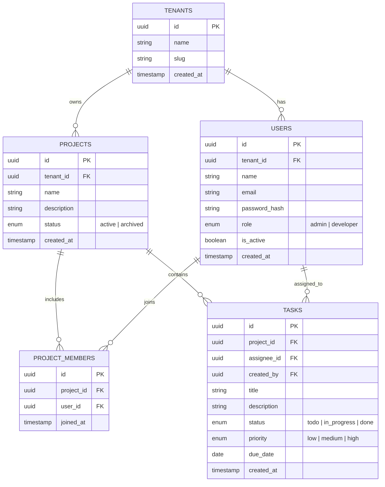

# TaskFlow

## 1. Overview

**TaskFlow** is a full-stack task management application: users can register, sign in, manage projects, and work with tasks via a React UI (plus a documented REST API).

**Tech stack**

| Layer      | Technology                                                                                                |
| ---------- | --------------------------------------------------------------------------------------------------------- |
| API        | Node.js, **Express 5**, TypeScript                                                                        |
| Database   | **PostgreSQL 16**, **node-pg-migrate** (SQL up/down migrations)                                           |
| Auth       | **bcrypt** (cost 12), **JWT** (`user_id`, `email`); **`Authorization: Bearer`** or **`authToken`** cookie |
| Validation | **zod**                                                                                                   |
| Logging    | **winston**                                                                                               |
| Frontend   | **React 18**, TypeScript, **Vite**, **MUI**, **TanStack Query**                                           |
| Run / DB   | **Docker Compose** (Postgres + API + frontend; optional **pgAdmin**)                                      |

---

## 2. Architecture Decisions

### Modular monolith

The backend is a **modular monolith**: one deployable Node app, but each business area (**auth**, **projects**, **tasks**) is a **vertical slice** with its own routes, controller, service, repository, validators, and dependency wiring. Shared infrastructure (DB pool, config, middleware, errors, logging) stays in `backend/src/shared/` and stays generic—not full of domain rules.

**Why this shape**

- **Fit for the assignment:** One service and one database are enough to meet the brief with less operational overhead than many small containers.
- **Clear boundaries:** Code that belongs together lives together, so reviews and refactors stay localized.
- **Honest dependencies:** When tasks need project checks, the tasks module depends on **projects’ service**, not its repository—same rule you would keep if those were separate network services.

**Moving toward microservices later**

- Nothing here locks us into a monolith forever. Each module is already a self-contained “mini app” (its own routes, migrations, and constructor-injected dependencies).

- Because the code is modular, extracting a module is mostly moving folders + adding transport, not untangling messy imports.

### Other backend choices

- Migrations + optional seed on docker compose up: On container start, backend/scripts/entrypoint.sh runs npm run migrate; if RUN_SEED=1, it applies seed.sql; then it starts the server.

---

## 3. Database schema

TaskFlow uses a **multitenant** PostgreSQL schema. All users and projects belong to a **tenant**. Project access is granted through **`project_members`** (not a single owner). Users have a **role** within their tenant: `admin` or `developer`.



### Relationships

- A **tenant** has many users and many projects.
- A **user** belongs to one tenant; email is unique per tenant (`tenant_id` + `email`).
- A **project** belongs to one tenant and has many members via `project_members`.
- **Tasks** belong to a project; `assignee_id` and `created_by` reference users.

### Access rules

| Role | Project visibility | Project mutations | User management |
| ---- | ---------------- | ----------------- | --------------- |
| **admin** | All projects in tenant | Create, update, delete any tenant project | List users, change roles, toggle `is_active`, manage project members |
| **developer** | Only projects where listed in `project_members` | Update/delete only if a member (delete project: admin only) | None |

### Registration

New users **auto-join** the default tenant (`slug: taskflow`). They are created with role `developer` and `is_active = true`.

### Schema notes

- `users.password` was renamed to `password_hash`.
- `projects.owner_id` was removed; the creator is inserted into `project_members`.
- `tasks.updated_at` is retained for API compatibility (not shown in the diagram).

---

## 4. Running Locally

- Install **Docker** in local machine.

- Replace the clone URL with this repository’s URL.

```bash
git clone https://github.com/<your-org-or-user>/taskflow-sagnik-ghosh.git
cd taskflow-sagnik-ghosh
cd backend && cp .env.example .env && cd ..
docker compose up --build
```

- Frontend will be available at **http://localhost:3000** (nginx serves the SPA).

- Backend API will be available at **http://localhost:4000**.

- The frontend container is configured to **proxy API requests** (so the browser calls the frontend origin, which forwards to the backend). In practice, the UI uses `/api/...` paths through nginx, keeping local CORS/simple networking predictable.

**Local development without Docker (optional)**

Run the database in Docker, then start the API and UI on your machine:

```bash
# 1. Database only (keep this running)
docker compose up postgres -d

# 2. Backend (from repo root)
cd backend
npm install          # required once — without this, `npm run dev` fails with "tsx: command not found"
cp .env.example .env # if you don't have backend/.env yet
# In backend/.env use POSTGRES_HOST=localhost (not `postgres` — that hostname only works inside Docker)
npm run dev          # http://localhost:4000

# 3. Frontend (new terminal)
cd frontend
npm install
npm run dev          # http://localhost:5173 — Vite proxies /api → localhost:4000
```

**Common local issues**

| Symptom | Fix |
| -------- | ----- |
| `tsx: command not found` or `MODULE_NOT_FOUND` | Run `npm install` in `backend/` (dependencies are not committed). |
| `ENOTFOUND postgres` | Set `POSTGRES_HOST=localhost` in `backend/.env` when running the API on your host. |
| `ECONNREFUSED` on port 5432 | Start Postgres: `docker compose up postgres -d` (or run a local Postgres on 5432). |
| `npm run start` fails | Run `npm run build` first — `start` runs compiled `dist/server.js`. Prefer `npm run dev` while developing. |

### PostgreSQL in pgAdmin (Docker Compose)

- Open **http://localhost:8080/**.

- Sign in with **email** `admin@example.com` and **password** `admin`.

- Then add a new server: **name** `taskflow`, **host** `postgres`, **username** `postgres`, **password** `postgres`, then click **Save**.

- You can see tables under **taskflow** → **Databases** → **taskflow** → **Schemas** → **public** → **Tables**.

---

## 5. Environment variables

Copy `backend/.env.example` to `backend/.env` and set at least **JWT_SECRET**.

### Application runtime

| Variable                     | Required | Default (if unset) | Notes                                                  |
| ---------------------------- | -------- | ------------------ | ------------------------------------------------------ |
| `JWT_SECRET`                 | **Yes**  | —                  | Non-empty string; app throws at startup if missing.    |
| `JWT_EXPIRES_IN`             | No       | `24h`              | JWT lifetime passed to `jsonwebtoken`.                 |
| `PORT`                       | No       | `4000`             | HTTP listen port.                                      |
| `NODE_ENV`                   | No       | `development`      | Affects cookie `secure` flag when `production`.        |
| `POSTGRES_HOST`              | No       | `localhost`        | In Docker, Compose overrides to `postgres`.            |
| `POSTGRES_PORT`              | No       | `5432`             |                                                        |
| `POSTGRES_DB`                | No       | `taskflow`         |                                                        |
| `POSTGRES_USER`              | No       | `postgres`         |                                                        |
| `POSTGRES_PASSWORD`          | No       | `postgres`         |                                                        |
| `PASSWORD_MIN_LENGTH`        | No       | `8`                | Minimum password length on register.                   |
| `PASSWORD_REQUIRE_UPPERCASE` | No       | `true`             | Set `false` in `backend/.env` for relaxed demo policy. |
| `PASSWORD_REQUIRE_LOWERCASE` | No       | `true`             |                                                        |
| `PASSWORD_REQUIRE_NUMBERS`   | No       | `true`             |                                                        |
| `PASSWORD_REQUIRE_SYMBOLS`   | No       | `true`             |                                                        |

### Migrations and seed

| Variable       | Required                     | Default                                         | Notes                                                                                                              |
| -------------- | ---------------------------- | ----------------------------------------------- | ------------------------------------------------------------------------------------------------------------------ |
| `DATABASE_URL` | **Yes** (for migrate + seed) | —                                               | Used by `npm run migrate` and `psql` when applying `seed.sql`. Docker Compose sets this for the backend container. |
| `RUN_SEED`     | No                           | `1` in Compose; `0` in `entrypoint.sh` if unset | `1` runs `seed.sql` after migrations.                                                                              |

---

## 6. Running Migrations

Migrations run **automatically** when the backend container starts (`backend/scripts/entrypoint.sh` runs `npm run migrate` before the server).

If you run the backend **on the host** and need to migrate manually:

```bash
cd backend
npm install
cp .env.example .env   # set DATABASE_URL and JWT_SECRET
npm run migrate
```

Rollback (when needed): `npm run migrate:down` from `backend/`.

---

## 7. Test Credentials

After seed runs (`RUN_SEED=1` in Docker by default), log in without registering:

|              |                    |
| ------------ | ------------------ |
| **Email**    | `test@example.com` |
| **Password** | `password123`      |
| **Tenant**   | `taskflow` (default) |
| **Role**     | `admin`            |

**Note:** Password rules are configurable via `PASSWORD_*` env vars; `backend/.env.example` uses a demo-friendly policy so the seed password works for registration too.

---

## 8. API Reference

**Base URL:** `http://localhost:4000`

### Frontend notes (how it uses the API)

- The UI is a React SPA (Vite) with MUI components.
- **Routing:** Auth screens (login/register) and protected app screens (projects list, project detail).
- **Auth/session behavior:**
  - The backend sets an `authToken` cookie on login/register; the UI also supports using the returned JWT for API calls.
  - The API client attaches credentials/tokens automatically and surfaces friendly errors (e.g., 401 → requires login, 403 → “forbidden” messaging).
- **Server state (TanStack Query):**
  - Project detail and tasks are fetched/cached via query keys and **invalidated** after task create/update/delete.
  - Errors and loading states are rendered as dedicated UI states.
- **Tasks UX details:**
  - **Filters:** status filter plus assignee filter.
  - **Optimistic updates:** status changes update immediately; on failure, the UI reverts to the previous task list and shows an error.
  - **Create/Edit modal validation (zod):** title required; description optional; assignee nullable; due date must be `YYYY-MM-DD` when provided.

### Swagger (OpenAPI)

The backend serves **Swagger UI** at **`/api-docs`** (full URL when running locally: `http://localhost:4000/api-docs`). The bundled spec describes the same routes as this section, including request bodies, common errors, and **Bearer JWT** security for protected endpoints.

**Tips**

- Log in via **Try it out** on `POST /auth/login`, copy `data.token` from the response, then click **Authorize** and paste `Bearer <token>` or only the token (depending on Swagger UI version).
- **Persist authorization** is enabled so the token survives a page refresh in the docs.

### Postman

A Postman Collection file is available at [`backend/docs/taskflow-sagnik-ghosh.postman_collection.json`](./backend/docs/taskflow-sagnik-ghosh.postman_collection.json). Import it into Postman to quickly try all endpoints.

**Auth:** Primarily relies on the **`authToken`** cookie set by `POST /auth/register` and `POST /auth/login`. If not found, it falls back to `Authorization: Bearer <your-jwt>`. In Postman, when you hit login or register, if cookie is set properly, you can run authenticated routes directly without setting Authorization.

### Success envelope

Most successful JSON responses use:

```json
{
  "success": true,
  "message": "…",
  "data": {},
  "statusCode": 200,
  "timestamp": "2026-04-14T12:00:00.000Z"
}
```

### Error shapes

| HTTP           | Body                                                           |
| -------------- | -------------------------------------------------------------- |
| 400 validation | `{ "error": "validation failed", "fields": { "email": "…" } }` |
| 401            | `{ "error": "unauthorized" }`                                  |
| 403            | `{ "error": "forbidden" }`                                     |
| 404            | `{ "error": "not found" }`                                     |
| 500            | `{ "error": "internal server error" }`                         |

---

### Health

| Method | Path      | Auth | Description           |
| ------ | --------- | ---- | --------------------- |
| GET    | `/health` | No   | Liveness / basic info |

**200** — `data` includes `status`, `timestamp`, `uptime`.

---

### Auth

| Method | Path             | Auth | Description                                    |
| ------ | ---------------- | ---- | ---------------------------------------------- |
| POST   | `/auth/register` | No   | Create user; sets cookie; returns token + user |
| POST   | `/auth/login`    | No   | Login; sets cookie; returns token + user       |
| GET    | `/auth/profile`  | Yes  | Current user profile                           |

---

### Projects

| Method | Path                  | Auth  | Description                                      |
| ------ | --------------------- | ----- | ------------------------------------------------ |
| GET    | `/projects`           | Yes   | List projects (admin: all in tenant; developer: member projects) |
| POST   | `/projects`           | Yes   | Create project; creator added to `project_members` |
| GET    | `/projects/:id`       | Yes   | Project detail including tasks                   |
| GET    | `/projects/:id/stats` | Yes   | Task counts by status and by assignee            |
| PATCH  | `/projects/:id`       | Yes   | Update name/description/status (admin or member) |
| DELETE | `/projects/:id`       | Yes   | Delete project and tasks (**admin** only)        |
| POST   | `/projects/:id/members` | Admin | Add user to project (`user_id` in body)        |
| DELETE | `/projects/:id/members/:userId` | Admin | Remove user from project              |

---

### Users (admin)

| Method | Path           | Auth  | Description                                |
| ------ | -------------- | ----- | ------------------------------------------ |
| GET    | `/users`       | Admin | List users in the caller's tenant          |
| PATCH  | `/users/:id`   | Admin | Update `role` and/or `is_active`           |

---

### Tasks

| Method | Path                  | Auth | Description                                             |
| ------ | --------------------- | ---- | ------------------------------------------------------- |
| GET    | `/projects/:id/tasks` | Yes  | List tasks; query: `?status=`, `?assignee=<uuid>`       |
| POST   | `/projects/:id/tasks` | Yes  | Create task in project                                  |
| PATCH  | `/tasks/:id`          | Yes  | Update task fields                                      |
| DELETE | `/tasks/:id`          | Yes  | Delete task (admin, or member who created it)        |

**Task `status`:** `todo` | `in_progress` | `done`  
**Task `priority`:** `low` | `medium` | `high`

---

## 9. What I’d Do With More Time

- **Tests:** Integration tests for auth, projects, and tasks.
- **Pagination:** `?page` / `?limit` on list endpoints like projects & tasks.
- **Security:** Per-route rate limits, refresh tokens or shorter access tokens.
- **Observability:** Request IDs, consistent structured logging on every line, and basic route-level metrics (latency, errors).
- **API contract:** Keep Swagger in sync with Zod by generating or checking OpenAPI from the same schemas.
- **UX/UI:** Add richer UX (assignee picker backed by a real users endpoint, better keyboard shortcuts, and stronger empty/error state coverage across all pages).
- **Project stats:** Extend `/projects/:id/stats` and surface it in the UI (task counts by status/assignee, trends, overdue counts).
- **Drag-and-drop tasks:** Kanban-style board interactions to move tasks across `todo → in_progress → done`.
- **Dark mode:** Theme toggle that persists across sessions.

Shortcuts: Code structure and architecture are my own design; I used AI only for some repetitive tasks which are known to me.
