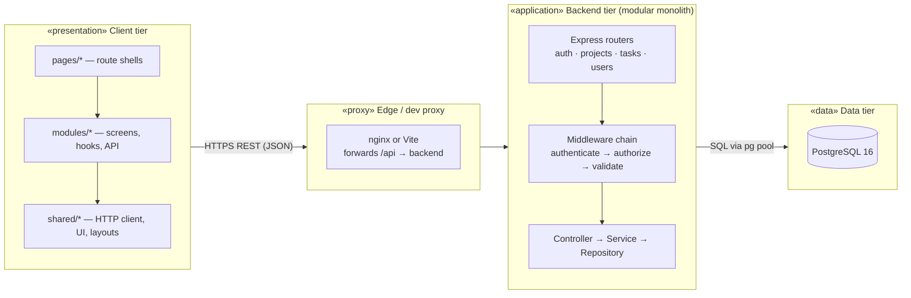
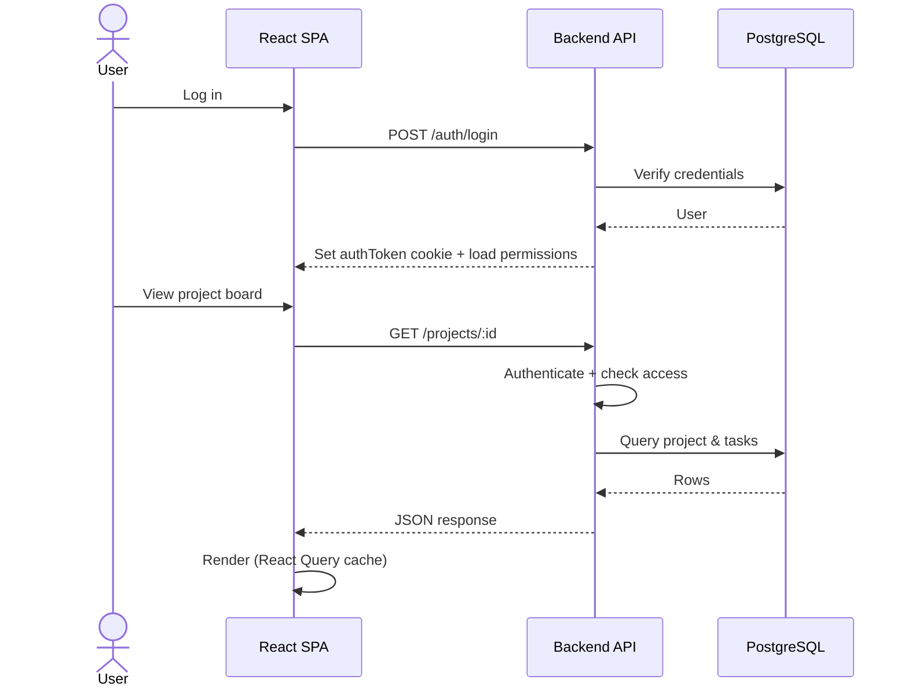
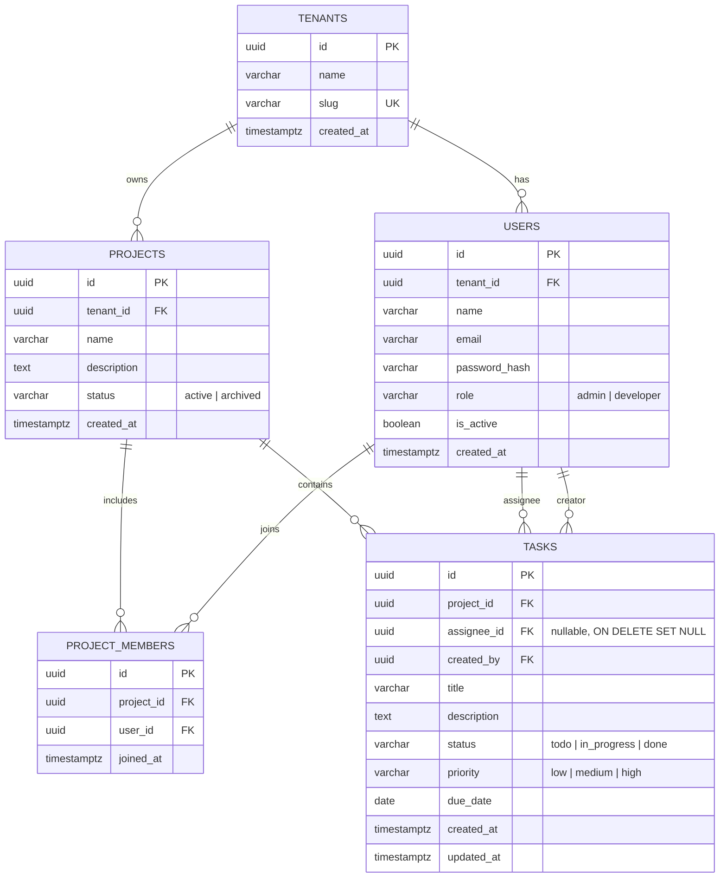

# TaskFlow - Full-Stack Task Management

TaskFlow is a multitenant task management application for teams. Users register, sign in, manage projects, and work with tasks through the frontend UI. Admins control tenant users and project membership; developers work within projects they belong to.

https://github.com/user-attachments/assets/18d71baf-80d1-4fc1-8f1d-293cb1556965

### Test accounts

| Email | Role | Password | Access |
| ----- | ---- | -------- | ------ |
| `test@example.com` | **admin** | `password123` | All tenant projects; create/delete projects; manage users & project members; full task CRUD |
| `nikg26@gmail.com` | **developer** | `password123` | Member projects only; create/edit/delete tasks in those projects; no create project, no Users page |

## 🚀 Features

- **Authentication & sessions**: Register and login with JWT; session via `authToken` cookie or `Authorization: Bearer` header
- **Multitenant projects**: Projects scoped to tenants with member-based access via `project_members`
- **Role-based access control (RBAC)**: Admin vs developer permissions enforced on API routes and gated in the UI
- **Project dashboard**: Project cards with progress stats; admins can create and delete projects
- **Kanban board**: Project detail view with create/edit task modals, filter and sort panels
- **My tasks**: Table of all tasks assigned to the current user across accessible projects
- **User management (admin)**: Tenant user list with role and active status controls
- **Project members (admin)**: Add and remove members from the project detail sidebar
- **Optimistic UI**: Task and project mutations update immediately with rollback on failure

## 📋 Table of Contents

- [Architecture](#-architecture)
- [Tech Stack](#-tech-stack)
- [Getting Started](#-getting-started)
- [Deployment](#-deployment)
- [Project Structure](#-project-structure)
- [Frontend](#-frontend)
- [API Documentation](#-api-documentation)
- [Development Guide](#-development-guide)
- [Contributing](#-contributing)
- [Troubleshooting](#-troubleshooting)

## 🏗 Architecture

TaskFlow is a three-tier, modular monolith: a React SPA talks to an Express API over REST; the API persists data in PostgreSQL with tenant-scoped RBAC.

### Assumptions

Single-workspace MVP today — multitenancy is in the schema, but everyone uses one tenant (`taskflow`):

- **One tenant** — no tenant picker; all auth flows use the default slug
- **Two roles** — `admin` and `developer` only
- **Register → developer** — signups never create an admin
- **Admins via seed/ops** — test users (`admin` + `developer`) come from `seed.sql`, not self-registration

### Future scope

- **Superadmin portal** — create tenants and each tenant's first admin
- **Tenant admin UI** — promote users and toggle active status on the Users page

Until then, bootstrap tenants and admins via **seed** or **ops scripts**.

### System components




### Request flow

A typical session: login sets an `authToken` cookie; later requests send that cookie and the API checks auth and permissions before reading or writing data.




### Database design

TaskFlow uses a **multitenant** relational schema. Every user and project belongs to a **tenant**. Project access is granted through `**project_members`** (many-to-many). Users carry a tenant **role** (`admin` | `developer`) that drives RBAC.




#### Tables and constraints


| Table             | Purpose                                      | Key constraints                                                          |
| ----------------- | -------------------------------------------- | ------------------------------------------------------------------------ |
| `tenants`         | Organization boundary for users and projects | `slug` unique                                                            |
| `users`           | Authenticated accounts                       | `(tenant_id, email)` unique; FK → `tenants`; default role `developer`    |
| `projects`        | Work containers within a tenant              | FK → `tenants`; `status` ∈ `active`, `archived`                          |
| `project_members` | Who may access a project                     | `(project_id, user_id)` unique; cascade delete with project/user         |
| `tasks`           | Work items on a project                      | FK → `projects` (cascade), `users` (assignee set null, creator required) |


#### Indexes


| Index                 | Column(s)            | Used for                            |
| --------------------- | -------------------- | ----------------------------------- |
| `idx_projects_tenant` | `projects.tenant_id` | Tenant-scoped project lists (admin) |
| `idx_tasks_project`   | `tasks.project_id`   | Kanban / project task queries       |
| `idx_tasks_assignee`  | `tasks.assignee_id`  | My Tasks view                       |
| `idx_tasks_status`    | `tasks.status`       | Status filters                      |


#### Access rules


| Role          | Project visibility     | Project mutations                                      | User management                                              |
| ------------- | ---------------------- | ------------------------------------------------------ | ------------------------------------------------------------ |
| **admin**     | All projects in tenant | Create, update, delete any tenant project              | List users, change roles, toggle `is_active`, manage members |
| **developer** | Only member projects   | Update/delete if a member (delete project: admin only) | None                                                         |


New users **auto-join** the default tenant as `developer` with `is_active = true`. See [Assumptions](#assumptions) for registration and role behavior.

### Key design patterns

1. **Modular monolith (vertical slices)**
  - One deployable Node app; each domain (**auth**, **projects**, **tasks**, **users**) owns routes, controller, service, repository, validators, and dependency wiring
  - Shared infrastructure (DB pool, config, middleware, errors, logging) lives in `backend/src/shared/`
  - Cross-module calls go through services, not repositories — the same rule you would keep if these were separate network services
2. **Role-based access control**
  - Permissions defined in `backend/src/shared/permissions/permissions.ts` and enforced via `authorize()` middleware
  - Frontend loads `GET /auth/permissions` after login and gates UI with `<Can>` / `useCan()`
  - See `[docs/rbac-implementation-guide.md](./docs/rbac-implementation-guide.md)` for the full permission model
3. **Feature modules on the frontend**
  - Route files under `pages/` are thin shells; domain API, types, hooks, and UI live in `modules/<feature>/`
  - Server state via TanStack Query; global session state via Zustand (auth only)
  - Optimistic cache updates for task and project mutations with rollback on error

### RBAC summary

Permission strings use `action:resource`. The API enforces them via `authorize()`; the frontend mirrors them as camelCase flags from `GET /auth/permissions`.


| Permission               | Flag                   | Admin | Developer | Gates                                                    |
| ------------------------ | ---------------------- | ----- | --------- | -------------------------------------------------------- |
| `create:project`         | `createProject`        | ✓     | ✗         | Create project UI, `POST /projects`                      |
| `delete:project`         | `deleteProject`        | ✓     | ✗         | Delete project UI, `DELETE /projects/:id`                |
| `update:project`         | `updateProject`        | ✓     | ✓*        | Update project; *developer needs project membership      |
| `view:project`           | `viewProject`          | ✓     | ✓*        | List/view projects; *developer sees member projects only |
| `manage:project_members` | `manageProjectMembers` | ✓     | ✗         | Members panel, `POST/DELETE /projects/:id/members`       |
| `manage:users`           | `manageUsers`          | ✓     | ✗         | Users page, `GET/PATCH /users`                           |
| `create:task`            | `createTask`           | ✓     | ✓*        | Create task UI, `POST /tasks`; *requires project access  |
| `update:task`            | `updateTask`           | ✓     | ✓*        | Edit task; *requires project access                      |
| `view:task`              | `viewTask`             | ✓     | ✓*        | View tasks; *requires project access                     |
| `delete:task`            | `deleteTask`           | ✓     | ✓*        | Delete task; *admin or member who created the task       |


**Admin** — all tenant projects. **Developer** — only `project_members` projects; task delete also checks creator in the service layer.

See `[docs/rbac-implementation-guide.md](./docs/rbac-implementation-guide.md)` for route mapping and implementation details.

## 🛠 Tech Stack

### Backend

- **Runtime**: Node.js 18+
- **Framework**: Express 5, TypeScript
- **Database**: PostgreSQL 16, **node-pg-migrate** (SQL up/down migrations)
- **Auth**: bcrypt (cost 12), JWT (`user_id`, `email`); `Authorization: Bearer` or `authToken` cookie
- **Validation**: Zod
- **Logging**: Winston
- **API docs**: Swagger UI at `/api-docs`

### Frontend

- **Framework**: React 19, TypeScript
- **Build tool**: Vite
- **Routing**: React Router
- **Server state**: TanStack Query
- **Client state**: Zustand (auth session persistence)
- **HTTP client**: Axios (`shared/http/client.ts`)
- **Validation**: Zod (form schemas)
- **UI**: Custom design system, Lucide icons — see `[docs/Frontend-Design-System.md](./docs/Frontend-Design-System.md)`

### Infrastructure

- **Docker Compose**: Postgres + API + frontend (optional pgAdmin)
- **Migrations + seed**: `backend/scripts/entrypoint.sh` runs `npm run migrate` on container start; applies `seed.sql` when `RUN_SEED=1`

## 🚦 Getting Started

### Prerequisites

- **Docker** (recommended for full stack)
- **Node.js 18+** and **npm** (for local development without Docker)
- **JWT_SECRET** in `backend/.env` (required; app throws at startup if missing)

### Quick start (Docker Compose)

```bash
git clone https://github.com/sagnik26/Task-Manager.git
cd Task-Manager
cd backend && cp .env.example .env && cd ..
cd frontend && cp .env.example .env && cd ..
docker compose up --build
```

#### Access:

- **Frontend**: [http://localhost:3000](http://localhost:3000) (nginx serves the SPA; proxies `/api` to the backend)
- **Backend API**: [http://localhost:4000](http://localhost:4000)
- **Swagger UI**: [http://localhost:4000/api-docs](http://localhost:4000/api-docs)
- **PostgreSQL**: [http://localhost:5432](http://localhost:5432) — database `taskflow`, user `postgres`, password `postgres`
- **pgAdmin**: [http://localhost:8080](http://localhost:8080) — email `admin@example.com`, password `admin`

#### Test credentials (after seed):

See [Test accounts](#test-accounts-existing-db-users) at the top of this README — `test@example.com` (admin) and `nikg26@gmail.com` (developer), both `password123`.


### Manual setup (alternative)

Expand for local development without full Docker stack

Run the database in Docker, then start the API and UI on your machine:

```bash
# 1. Database only (keep this running)
docker compose up postgres -d

# 2. Backend (from repo root)
cd backend
npm install          # required once
cp .env.example .env # set JWT_SECRET; use POSTGRES_HOST=localhost
npm run dev          # http://localhost:4000

# 3. Frontend (new terminal)
cd frontend
npm install
npm run dev          # http://localhost:5173 — Vite proxies /api → localhost:4000
```


### Environment variables

Copy `backend/.env.example` to `backend/.env` and set at least **JWT_SECRET**.


| Variable              | Required               | Default        | Notes                                                   |
| --------------------- | ---------------------- | -------------- | ------------------------------------------------------- |
| `JWT_SECRET`          | **Yes**                | —              | Non-empty string; app throws at startup if missing      |
| `JWT_EXPIRES_IN`      | No                     | `24h`          | JWT lifetime                                            |
| `PORT`                | No                     | `4000`         | HTTP listen port                                        |
| `NODE_ENV`            | No                     | `development`  | Affects cookie `secure` flag when `production`          |
| `POSTGRES_HOST`       | No                     | `localhost`    | Compose overrides to `postgres` in Docker               |
| `POSTGRES_PORT`       | No                     | `5432`         |                                                         |
| `POSTGRES_DB`         | No                     | `taskflow`     |                                                         |
| `POSTGRES_USER`       | No                     | `postgres`     |                                                         |
| `POSTGRES_PASSWORD`   | No                     | `postgres`     |                                                         |
| `DATABASE_URL`        | **Yes** (migrate/seed) | —              | Used by `npm run migrate` and seed                      |
| `RUN_SEED`            | No                     | `1` in Compose | `1` runs `seed.sql` after migrations                    |
| `PASSWORD_MIN_LENGTH` | No                     | `8`            | Minimum password length on register                     |
| `PASSWORD_REQUIRE_`*  | No                     | `true`         | Set individual flags to `false` for relaxed demo policy |


### Migrations

Migrations run **automatically** when the backend container starts. For host-side backend:

```bash
cd backend
npm install
cp .env.example .env   # set DATABASE_URL and JWT_SECRET
npm run migrate
```

Rollback when needed: `npm run migrate:down`

### pgAdmin (Docker Compose)

1. Open [http://localhost:8080](http://localhost:8080)
2. Sign in: email `admin@example.com`, password `admin`
3. Add server: name `taskflow`, host `postgres`, username `postgres`, password `postgres`
4. Browse tables under **taskflow** → **Databases** → **taskflow** → **Schemas** → **public** → **Tables**

## 🌐 Deployment

| Component | Platform |
| --------- | -------- |
| **Frontend** | [Vercel](https://vercel.com) |
| **Backend** | [Railway](https://railway.app) — Docker container (`backend/Dockerfile`) |
| **Database** | [Supabase](https://supabase.com) — managed PostgreSQL |

Step-by-step guide: [`docs/deployment.md`](./docs/deployment.md).

## 📁 Project Structure

```
taskflow-sagnik-ghosh/
├── backend/
│   ├── src/
│   │   ├── modules/              # auth, projects, tasks, users (vertical slices)
│   │   │   └── <module>/
│   │   │       ├── routes/
│   │   │       ├── controllers/
│   │   │       ├── services/
│   │   │       ├── repositories/
│   │   │       ├── validators/
│   │   │       └── dependencies/
│   │   ├── shared/               # DB pool, config, middleware, permissions, utils
│   │   └── app.ts
│   ├── migrations/
│   ├── scripts/entrypoint.sh
│   ├── seed.sql
│   └── .env
│
├── frontend/
│   ├── public/
│   ├── tests/
│   ├── src/
│   │   ├── main.tsx
│   │   ├── app/App.tsx           # routes → pages/*
│   │   ├── pages/                # thin route shells only
│   │   ├── modules/              # feature domains (auth, projects, tasks, users)
│   │   └── shared/               # http, types, utils, theme, ui, layouts, permissions
│   ├── vite.config.ts            # `@` → `src`
│   └── nginx.conf
│
├── docs/
│   ├── rbac-implementation-guide.md
│   ├── Frontend-Design-System.md
│   └── taskflow-sagnik-ghosh.postman_collection.json
│
└── docker-compose.yml
```

## 🖥 Frontend

React + TypeScript + Vite SPA for the TaskFlow project management UI.

### Pages vs modules

- **`pages/`** — connect URLs to screens (routing only)
- **`modules/`** — feature code (UI, API calls, hooks, types)

```
pages/                          # routes only — import a Screen and render it
├── auth/
│   ├── LoginPage.tsx           # → LoginScreen
│   └── RegisterPage.tsx        # → RegisterScreen
├── projects/
│   ├── ProjectsListPage.tsx    # → ProjectsListScreen
│   └── ProjectDetailPage.tsx   # → ProjectDetailScreen (passes route id)
├── tasks/
│   └── MyTasksPage.tsx         # → MyTasksScreen
└── users/
    └── UsersPage.tsx           # → UsersScreen
```

```
modules/<feature>/              # all feature logic lives here
├── index.ts          # what other files can import
├── api/              # API calls + query keys
├── types/
├── hooks/
├── components/
├── screens/          # full page UI (used by pages/*)
├── schemas/          # optional — form validation
├── utils/            # optional — helpers (e.g. cache updates)
└── context/          # optional — auth session only today
```

| Module     | Screens                       | Notes                          |
| ---------- | ----------------------------- | ------------------------------ |
| `auth`     | Login, Register               | login session (Zustand)        |
| `projects` | Projects list, Project detail | includes task board on detail  |
| `tasks`    | My tasks                      | kanban, filters, task modals   |
| `users`    | Users list                    | admin user directory           |


### Client state vs server state

| Module     | Primary state | Where it lives                  | Why                                           |
| ---------- | ------------- | ------------------------------- | --------------------------------------------- |
| `auth`     | **Client**    | `auth.store.ts` + `AuthContext` | Login session; stays after refresh            |
| `projects` | **Server**    | `useProjects` + React Query     | Projects from API; stored in React Query      |
| `tasks`    | **Server**    | task hooks + React Query        | Tasks from API; stored in React Query         |
| `users`    | **Server**    | `useUsers` + React Query        | User list from API; stored in React Query     |

**Rule of thumb**

- **Client** — login session only (Zustand)
- **Server** — data from the API (React Query cache)
- **Local** — temporary UI state: open modals, form fields, filters (`useState`)

### Optimistic mutations

The UI updates immediately; if the API fails, the change is rolled back. Helpers: `modules/*/utils/optimistic*Cache.ts`.


| Action         | Hook                     | Primary cache updated                      |
| -------------- | ------------------------ | ------------------------------------------ |
| Update task    | `useUpdateTask`          | `taskKeys.byProject`                       |
| Delete task    | `useDeleteTask`          | `taskKeys.byProject`                       |
| Create task    | `useCreateTask`          | `taskKeys.byProject` (temp id → server id) |
| Delete project | `useDeleteProject`       | `projectKeys.all`                          |
| Create project | `useCreateProject`       | `projectKeys.all` (temp id → server id)    |
| Remove member  | `useRemoveProjectMember` | `projectKeys.members`                      |
| Add member     | `useAddProjectMember`    | `projectKeys.members`                      |


**Auth is not optimistic** — login, register, and logout wait for the API before updating the session.

**Modals** — close right away on save/delete; errors show as toasts.

### Frontend scripts


| Command         | Description           |
| --------------- | --------------------- |
| `npm run dev`   | Start Vite dev server |
| `npm run build` | Production build      |
| `npm test`      | Run Vitest unit tests |
| `npm run lint`  | ESLint                |


## 📡 API Documentation

### Swagger (OpenAPI)

Swagger UI at `**/api-docs`**. Log in via **Try it out** on `POST /auth/login`, copy `data.token`, then **Authorize** with `Bearer <token>`.

### Error shapes


| HTTP           | Body                                                           |
| -------------- | -------------------------------------------------------------- |
| 400 validation | `{ "error": "validation failed", "fields": { "email": "…" } }` |
| 401            | `{ "error": "unauthorized" }`                                  |
| 403            | `{ "error": "forbidden" }`                                     |
| 404            | `{ "error": "not found" }`                                     |
| 500            | `{ "error": "internal server error" }`                         |


### Health


| Method | Path      | Auth | Description           |
| ------ | --------- | ---- | --------------------- |
| GET    | `/health` | No   | Liveness / basic info |


### Auth


| Method | Path                | Auth | Description                                    |
| ------ | ------------------- | ---- | ---------------------------------------------- |
| POST   | `/auth/register`    | No   | Create user; sets cookie; returns token + user |
| POST   | `/auth/login`       | No   | Login; sets cookie; returns token + user       |
| GET    | `/auth/profile`     | Yes  | Current user profile                           |
| GET    | `/auth/permissions` | Yes  | Permission flags for the current user's role   |


### Projects


| Method | Path                            | Auth  | Description                                                      |
| ------ | ------------------------------- | ----- | ---------------------------------------------------------------- |
| GET    | `/projects`                     | Yes   | List projects (admin: all in tenant; developer: member projects) |
| POST   | `/projects`                     | Yes   | Create project; creator added to `project_members`               |
| GET    | `/projects/:id`                 | Yes   | Project detail including tasks                                   |
| GET    | `/projects/:id/stats`           | Yes   | Task counts by status and by assignee                            |
| GET    | `/projects/:id/members`         | Yes   | List project members                                             |
| PATCH  | `/projects/:id`                 | Yes   | Update name/description/status (admin or member)                 |
| DELETE | `/projects/:id`                 | Yes   | Delete project and tasks (**admin** only)                        |
| POST   | `/projects/:id/members`         | Admin | Add user to project (`user_id` in body)                          |
| DELETE | `/projects/:id/members/:userId` | Admin | Remove user from project                                         |


### Users (admin)


| Method | Path         | Auth  | Description                       |
| ------ | ------------ | ----- | --------------------------------- |
| GET    | `/users`     | Admin | List users in the caller's tenant |
| PATCH  | `/users/:id` | Admin | Update `role` and/or `is_active`  |


### Tasks


| Method | Path                  | Auth | Description                                       |
| ------ | --------------------- | ---- | ------------------------------------------------- |
| GET    | `/projects/:id/tasks` | Yes  | List tasks; query: `?status=`, `?assignee=<uuid>` |
| POST   | `/projects/:id/tasks` | Yes  | Create task in project                            |
| PATCH  | `/tasks/:id`          | Yes  | Update task fields                                |
| DELETE | `/tasks/:id`          | Yes  | Delete task (admin, or member who created it)     |


**Task `status`:** `todo` | `in_progress` | `done`  
**Task `priority`:** `low` | `medium` | `high`

## 💻 Development Guide

### Adding a backend feature

1. **Service** (`backend/src/modules/<module>/services/`) — business logic
2. **Controller** (`backend/src/modules/<module>/controllers/`) — request/response handling
3. **Route** (`backend/src/modules/<module>/routes/`) — wire endpoint + `authorize()` middleware
4. **Validator** (`backend/src/modules/<module>/validators/`) — Zod schemas for request bodies

When modifying database schemas:

1. Add a migration in `backend/migrations/`
2. Update the repository/types in the owning module
3. Update API documentation in this README and Swagger annotations

### Adding a frontend feature

1. **Module** — add or extend `frontend/src/modules/<feature>/` following the module layout above
2. **Screen** — full page UI in `modules/<feature>/screens/`
3. **Page shell** — thin route wrapper in `pages/<feature>/`
4. **Route** — register in `src/app/App.tsx`
5. **API + hooks** — HTTP calls in `modules/<feature>/api/`, React Query hooks in `hooks/`

Example thin page:

```tsx
// pages/projects/ProjectDetailPage.tsx
import { useParams } from "react-router-dom";
import { ProjectDetailScreen } from "@/modules/projects";

export function ProjectDetailPage() {
  const { id } = useParams<{ id: string }>();
  if (!id) return null;
  return <ProjectDetailScreen projectId={id} />;
}
```

### Future improvements

**Production hardening** — full checklist in [`docs/production-hardening.md`](./docs/production-hardening.md):

| Priority | Area |
| -------- | ---- |
| High | Proxy misconfiguration guard, resilient Vercel middleware, explicit cookie policy, restrict CORS, rate limiting |
| Medium | Migration/deploy pipeline, observability and alerting, database backups and recovery |

**Platform** — see [Future scope](#future-scope) under Architecture:

- Superadmin portal (tenants + first admin per tenant)
- Tenant admin UI (promote users, toggle active status)

**Product & API**

- Integration tests across the app (auth, projects, tasks, RBAC)
- E2E tests for critical user flows
- Server-side filter/sort on `GET /projects/:id/tasks`
- Pagination (`?page` / `?limit`) on list endpoints
- Drag-and-drop on the Kanban board
- Refresh tokens or shorter-lived access tokens

## 🤝 Contributing

1. Fork the repository
2. Create a feature branch (`git checkout -b feature/amazing-feature`)
3. Commit your changes (`git commit -m 'Add amazing feature'`)
4. Push to the branch (`git push origin feature/amazing-feature`)
5. Open a Pull Request

### Code style

- Use async/await for asynchronous operations
- Follow existing naming conventions and module boundaries
- Add error handling and logging on the backend
- Keep functions focused and single-purpose

### Before submitting PR

- [ ] Code builds without errors (`npm run build` in backend and frontend)
- [ ] All existing features work
- [ ] New features are documented
- [ ] Environment variables are documented in README
- [ ] No API keys or secrets committed

## 🔧 Troubleshooting

### Common issues

#### 1. `tsx: command not found` or `MODULE_NOT_FOUND`

**Solution:** Run `npm install` in `backend/` — dependencies are not committed.

#### 2. `ENOTFOUND postgres`

**Solution:** Set `POSTGRES_HOST=localhost` in `backend/.env` when running the API on your host (the `postgres` hostname only works inside Docker).

#### 3. `ECONNREFUSED` on port 5432

**Solution:** Start Postgres: `docker compose up postgres -d`.

#### 4. `npm run start` fails

**Solution:** Run `npm run build` first — `start` runs compiled `dist/server.js`. Prefer `npm run dev` while developing.

#### 5. Frontend can't reach backend

- Verify backend is running on port 4000
- In Docker, the frontend proxies `/api` via nginx
- In local dev, Vite proxies `/api` → `localhost:4000`
- Check browser console for CORS or 401/403 errors

### Logs

Backend logs:

- Development: console output
- Winston configured for structured logging

