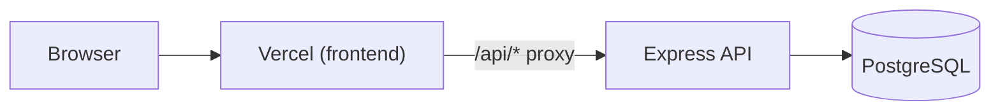

# Deployment Guide — TaskFlow

TaskFlow is a **split deployment**: a static React frontend, a long-running Express API, and PostgreSQL. Deploy each piece separately.

| Component | Recommended host | Why |
| --------- | ---------------- | --- |
| Frontend (`frontend/`) | **Vercel** (or Netlify) | Static Vite build + SPA routing |
| Backend (`backend/`) | **Render**, **Railway**, **Fly.io** | Express server with a persistent Postgres pool |
| Database | **Neon**, **Supabase**, **Render Postgres** | Managed PostgreSQL |

The browser should call the **frontend origin** at `/api/...`. The host proxies those requests to the backend (same pattern as Docker/nginx and Netlify).

---

## 1. Database

1. Create a PostgreSQL 16 database on your provider.
2. Copy the connection string — you will use it as `DATABASE_URL` for migrations and the backend.

---

## 2. Backend (Express API)

### Build and start

From `backend/`:

```bash
npm ci
npm run build
npm run migrate    # requires DATABASE_URL
npm start          # runs dist/server.js on PORT (default 4000)
```

On platforms like Render or Railway, set:

- **Build command:** `npm ci && npm run build`
- **Start command:** `npm run migrate && npm start`  
  (or run migrations in a release/deploy hook if your host supports it)

### Required environment variables

| Variable | Required | Notes |
| -------- | -------- | ----- |
| `DATABASE_URL` | **Yes** | Postgres connection string (migrations + runtime) |
| `JWT_SECRET` | **Yes** | Long random string; app fails to start if missing |
| `NODE_ENV` | Recommended | Set to `production` in production |
| `PORT` | No | Default `4000`; most hosts inject this automatically |

See `backend/.env.example` and the [README environment section](../README.md#5-environment-variables) for optional variables (`JWT_EXPIRES_IN`, password policy, etc.).

### Seed data (optional)

To load demo users after migrations:

```bash
psql "$DATABASE_URL" -v ON_ERROR_STOP=1 -f seed.sql
```

In Docker Compose this runs when `RUN_SEED=1`. On a hosted backend, run it once manually or from a deploy script.

### Verify

```bash
curl https://YOUR_BACKEND_URL/health
```

You should get a JSON health payload.

---

## 3. Frontend (Vercel)

### Create the project

1. Import the repo in [Vercel](https://vercel.com).
2. Set **Root Directory** to `frontend`.
3. Vercel should detect **Vite** from `frontend/vercel.json`:
   - **Build command:** `npm ci && npm run build`
   - **Output directory:** `dist`

### Connect frontend to backend

The frontend axios client uses `VITE_API_URL` when set, otherwise **`/api`** (see `frontend/src/shared/http/client.ts`). Choose one approach:

#### Option A — Proxy via `/api` (recommended)

Same-origin requests keep HttpOnly auth cookies simple.

1. In Vercel → **Project → Settings → Environment Variables**, add:

   | Name | Example | Environments |
   | ---- | ------- | ------------ |
   | `BACKEND_PROXY_URL` | `https://taskflow-api.onrender.com` | Production, Preview |

   Do **not** include a trailing slash.

2. **`frontend/middleware.ts`** proxies `/api/*` to `BACKEND_PROXY_URL` (strips the `/api` prefix, matching `frontend/nginx.conf`).

3. Leave `VITE_API_URL` unset so the client keeps using `/api`.

#### Option B — Direct backend URL

1. Set a build-time variable in Vercel:

   | Name | Example |
   | ---- | ------- |
   | `VITE_API_URL` | `https://taskflow-api.onrender.com` |

2. Remove or ignore the `/api` rewrite in `frontend/vercel.json` — the browser calls the backend directly.

3. CORS is already open with credentials in `backend/src/app.ts`. Ensure cookies use `Secure` in production (`NODE_ENV=production` on the backend).

#### Option C — Static rewrite in `vercel.json`

If you prefer not to use middleware, edit `frontend/vercel.json` and replace `YOUR_BACKEND_URL` with your live API host:

```json
{
  "source": "/api/:path*",
  "destination": "https://taskflow-api.onrender.com/:path*"
}
```

When `BACKEND_PROXY_URL` is set, middleware takes precedence over this static rewrite.

### Deploy

Push to your default branch or run:

```bash
cd frontend
vercel --prod
```

### Verify

1. Open the Vercel deployment URL.
2. Log in with seed credentials (see [README](../README.md#7-test-credentials)) if you ran `seed.sql`.
3. Confirm network requests go to `/api/auth/login` (Option A) or your backend URL (Option B).

---

## 4. Netlify (alternative frontend host)

The repo includes `netlify.toml` at the repo root. Configure:

- **Base directory:** `frontend`
- **Environment variable:** `BACKEND_PROXY_URL` → your backend URL

The build writes `dist/_redirects` via `frontend/scripts/write-netlify-redirects.mjs`.

---

## 5. Architecture diagram



---

## 6. Troubleshooting

| Symptom | Likely cause | Fix |
| ------- | ------------ | --- |
| `/api/...` returns HTML or 404 | Proxy not configured | Set `BACKEND_PROXY_URL` on Vercel, or set `VITE_API_URL`, or update `vercel.json` |
| Login works locally, fails in prod | Backend unreachable or wrong URL | Check `curl YOUR_BACKEND_URL/health` |
| 401 on every request after login | Cookie not sent cross-origin | Prefer Option A (same-origin `/api` proxy) |
| Backend crash on start | Missing `JWT_SECRET` or DB down | Check host logs and env vars |
| Empty database | Migrations/seed not run | Run `npm run migrate` and optionally `seed.sql` |

---

## 7. Local development vs production

| | Local (Docker Compose) | Production |
| - | ---------------------- | ---------- |
| Frontend | `http://localhost:5173` or nginx on `:80` | Vercel URL |
| API proxy | Vite dev proxy / nginx `/api` | Vercel middleware or rewrite |
| Database | Postgres container | Managed Postgres |
| Migrations | `entrypoint.sh` on container start | Deploy hook or manual `npm run migrate` |

For full local setup, see the [README](../README.md).

For production hardening beyond a working deploy, see [Production hardening](./production-hardening.md).
