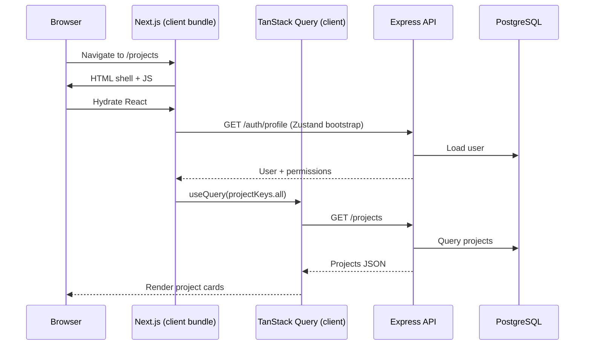
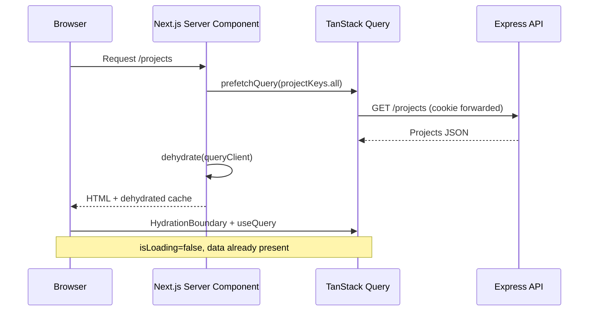

# Next.js + TanStack Query — Architecture & SSR Hydration Guide

This document describes how TaskFlow uses TanStack Query today, what that means in practice, and how to adopt the **full** Next.js + TanStack Query pattern (server prefetch + client hydration).

For broader frontend conventions, see the [Frontend section in the README](../README.md#-frontend). For deployment and API proxying, see [deployment.md](./deployment.md).

---

## Table of contents

1. [Current architecture](#current-architecture)
2. [Request flow today](#request-flow-today)
3. [What we get vs what we do not](#what-we-get-vs-what-we-do-not)
4. [Target architecture (full pattern)](#target-architecture-full-pattern)
5. [Migration guide](#migration-guide)
6. [Incremental adoption plan](#incremental-adoption-plan)
7. [Checklist](#checklist)

---

## Current architecture

TaskFlow uses **Next.js 15 (App Router)** for routing, layout, and API proxying, and **TanStack Query v5** for server state (projects, tasks, users). Auth session state lives in **Zustand**, not React Query.

This is a **client-first** setup: data is fetched in the browser after the page mounts. Next.js is not used to prefetch React Query data on the server.

### Layered responsibilities

| Layer | Location | Role |
| ----- | -------- | ---- |
| Route pages | `frontend/src/app/` | Thin wrappers; most are `"use client"` and render a screen component |
| Screens | `modules/<feature>/screens/` | Page UI; many call `useQuery` directly or via hooks |
| Hooks | `modules/<feature>/hooks/` | `useQuery` / `useMutation` wrappers |
| API | `modules/<feature>/api/` | Axios calls via `shared/http/client.ts` |
| Query keys | `modules/<feature>/api/query-keys.ts` | Hierarchical cache keys |
| Cache helpers | `modules/<feature>/utils/optimistic*Cache.ts` | Optimistic updates + invalidation |
| Providers | `shared/providers/Providers.tsx` | `QueryClientProvider`, auth, theme, toasts |
| Auth | `modules/auth/context/` | Zustand store + `AuthContext` bootstrap |

### State ownership

| Data | Tool | Why |
| ---- | ---- | --- |
| Login session (`user`, `permissions`) | Zustand (`auth.store.ts`) + `AuthContext` | Persists across refresh; not API cache |
| Projects, tasks, users | TanStack Query | Server state from REST API |
| Modals, filters, form drafts | `useState` | Ephemeral UI state |

**Rule of thumb:** only auth is client-global state. Everything from the API goes through React Query.

### Provider setup

`QueryClient` is created once per browser session inside a client component:

```tsx
// shared/providers/Providers.tsx
const [queryClient] = useState(() => new QueryClient());
```

There is **no** shared server `QueryClient`, **no** `dehydrate` / `HydrationBoundary`, and **no** `prefetchQuery` on the server.

### Route structure

All authenticated app routes are client components:

```
app/
├── layout.tsx                    # Server Component — wraps <Providers>
├── (app)/
│   ├── layout.tsx                # "use client" — ProtectedRoute + AppShell
│   ├── projects/page.tsx         # "use client" → ProjectsListScreen
│   ├── projects/[id]/page.tsx    # "use client" → ProjectDetailScreen
│   ├── my-tasks/page.tsx         # "use client" → MyTasksScreen
│   └── users/page.tsx            # "use client" → UsersScreen
└── (auth)/
    ├── login/page.tsx            # "use client"
    └── register/page.tsx         # "use client"
```

The only Server Component pages today perform redirects (`/` → `/projects`, `/dashboard` → `/projects`).

### Data fetching pattern

Typical screen flow:

1. `ProtectedRoute` waits for auth bootstrap (`GET /auth/profile` via Zustand, not React Query).
2. Screen mounts and calls `useQuery` (or a hook like `useProjects`).
3. While `isLoading`, the screen renders `<LoadingState />`.
4. Data arrives; UI renders.
5. Mutations use optimistic updates, then `invalidateQueries` on settle.

Example from the projects list — client fetch with a loading gate:

```tsx
const projectsQuery = useQuery({
  queryKey: projectKeys.all,
  queryFn: listProjects,
});

if (projectsQuery.isLoading) {
  return <LoadingState label="Loading dashboard…" />;
}
```

### Query keys

Keys are centralized and hierarchical so invalidation stays predictable:

```ts
// projects
["projects"]
["projects", projectId]
["projects", projectId, "stats"]
["projects", projectId, "members"]

// tasks
["tasks", projectId]
["tasks", projectId, "assignee", userId]

// users
["users"]
```

Screens that share a key (e.g. `projectKeys.all` in the sidebar and projects list) share the same cache entry.

### Mutations and optimistic UI

Mutations follow a consistent lifecycle:

1. `cancelQueries` — avoid races with in-flight fetches
2. Optimistic `setQueryData` — instant UI
3. Rollback on error
4. `invalidateQueries` on settle — reconcile with server

Helpers live in `optimisticProjectCache.ts` and `optimisticTaskCache.ts`. See the [optimistic mutations table in the README](../README.md#optimistic-mutations).

### HTTP and auth

- Browser requests go to `/api/*` (Next.js rewrite or middleware proxy → Express backend).
- `apiClient` uses `withCredentials: true` so the HttpOnly `authToken` cookie is sent automatically.
- A 401 response clears the Zustand auth store and redirects to `/login`.
- **React Query cache is not cleared on logout** — a known gap if another user logs in on the same tab.

---

## Request flow today



**Key point:** the user sees loading states (`Checking session…`, then `Loading dashboard…`) before content appears.

---

## What we get vs what we do not

| Capability | Current setup | Full Next.js + TanStack Query |
| ---------- | ------------- | ----------------------------- |
| Client caching & background refetch | Yes | Yes |
| Optimistic mutations | Yes | Yes (unchanged on client) |
| Server prefetch into React Query cache | No | Yes |
| Instant first paint with data | No | Yes (for prefetched queries) |
| Reduced layout shift on initial load | Partial (loading gates) | Better (HTML includes data) |
| Hybrid Server Components + client interactivity | No | Yes |
| Next.js routing & bundling | Yes | Yes |

Today, data loading behaves like a **React SPA hosted inside Next.js**. That is a valid choice for an authenticated dashboard, but it does not use server-side React Query hydration.

---

## Target architecture (full pattern)

The full pattern prefetches queries in a **Server Component**, dehydrates the cache, and rehydrates it on the client so `useQuery` returns cached data immediately (no loading spinner on first render).



### Principles

1. **Server Components fetch; Client Components interact.** Prefetch on the server. Keep mutations, modals, and optimistic updates in client components.
2. **One `QueryClient` per request on the server.** Never share a server `QueryClient` across users or requests.
3. **One stable `QueryClient` in the browser.** Reuse the same client for the session (current `useState` pattern is fine).
4. **Same query keys everywhere.** Server prefetch and client `useQuery` must use identical keys and query functions.
5. **Forward auth cookies on server fetches.** The backend reads `authToken` from cookies; server-side `fetch` must pass the request cookie header.

---

## Migration guide

The steps below add the infrastructure for server prefetch/hydration. You can adopt them one page at a time.

### Step 1 — Shared `QueryClient` factory

Create `frontend/src/shared/query/get-query-client.ts`:

```ts
import {
  QueryClient,
  defaultShouldDehydrateQuery,
  isServer,
} from "@tanstack/react-query";

function makeQueryClient() {
  return new QueryClient({
    defaultOptions: {
      queries: {
        // Avoid immediate client refetch after hydration
        staleTime: 60 * 1000,
        retry: 1,
      },
      dehydrate: {
        // Prefetch both success and error states when needed
        shouldDehydrateQuery: (query) =>
          defaultShouldDehydrateQuery(query) ||
          query.state.status === "pending",
      },
    },
  });
}

let browserQueryClient: QueryClient | undefined;

export function getQueryClient() {
  if (isServer) {
    // New client per server request — never share across users
    return makeQueryClient();
  }
  if (!browserQueryClient) {
    browserQueryClient = makeQueryClient();
  }
  return browserQueryClient;
}
```

Update `Providers.tsx` to use `getQueryClient()` instead of inline `new QueryClient()`.

### Step 2 — Server-safe API fetch helper

`apiClient` (Axios) is built for the browser (`withCredentials`, Zustand 401 interceptor). Server Components need a `fetch` wrapper that forwards cookies from the incoming request.

Create `frontend/src/shared/http/server-api.ts`:

```ts
import { cookies } from "next/headers";

import { extractResponseData } from "@/shared/utils/apiResponse";

function getServerApiBaseUrl(): string {
  // Prefer direct backend URL on the server to skip an extra Next hop
  const backend = process.env.BACKEND_PROXY_URL?.replace(/\/$/, "");
  if (backend) return backend;
  // Fallback for local dev when only rewrites are configured
  const site = process.env.NEXT_PUBLIC_SITE_URL ?? "http://localhost:3000";
  return `${site.replace(/\/$/, "")}/api`;
}

export async function serverFetch<T>(
  path: string,
  init?: RequestInit,
): Promise<T> {
  const cookieStore = await cookies();
  const cookieHeader = cookieStore
    .getAll()
    .map((c) => `${c.name}=${c.value}`)
    .join("; ");

  const url = `${getServerApiBaseUrl()}${path.startsWith("/") ? path : `/${path}`}`;

  const res = await fetch(url, {
    ...init,
    headers: {
      ...init?.headers,
      cookie: cookieHeader,
      "content-type": "application/json",
    },
    cache: "no-store", // authenticated data — do not cache at CDN
  });

  if (!res.ok) {
    throw new Error(`API ${res.status}: ${path}`);
  }

  const json = await res.json();
  return extractResponseData<T>(json);
}
```

Add server-side API functions (or extend existing ones) that call `serverFetch` instead of `apiClient`. Keep browser functions unchanged to avoid pulling `next/headers` into client bundles.

Example:

```ts
// modules/projects/api/projects.server.ts
import { serverFetch } from "@/shared/http/server-api";
import type { Project } from "../types/projects.types";

export function listProjectsServer(): Promise<Project[]> {
  return serverFetch<Project[]>("/projects");
}
```

### Step 3 — Hydration provider wrapper

Create `frontend/src/shared/providers/QueryHydration.tsx`:

```tsx
"use client";

import { HydrationBoundary, type DehydratedState } from "@tanstack/react-query";

export function QueryHydration({
  state,
  children,
}: {
  state: DehydratedState;
  children: React.ReactNode;
}) {
  return (
    <HydrationBoundary state={state}>{children}</HydrationBoundary>
  );
}
```

### Step 4 — Prefetch in a Server Component page

Convert a route page from an all-client wrapper to a Server Component that prefetches, then renders the existing client screen inside `HydrationBoundary`.

**Before** (`app/(app)/projects/page.tsx`):

```tsx
"use client";

import { ProjectsListScreen } from "@/modules/projects";

export default function ProjectsPage() {
  return <ProjectsListScreen />;
}
```

**After:**

```tsx
import { dehydrate } from "@tanstack/react-query";

import { ProjectsListScreen } from "@/modules/projects";
import { listProjectsServer } from "@/modules/projects/api/projects.server";
import { projectKeys } from "@/modules/projects/api/query-keys";
import { QueryHydration } from "@/shared/providers/QueryHydration";
import { getQueryClient } from "@/shared/query/get-query-client";

export default async function ProjectsPage() {
  const queryClient = getQueryClient();

  await queryClient.prefetchQuery({
    queryKey: projectKeys.all,
    queryFn: listProjectsServer,
  });

  return (
    <QueryHydration state={dehydrate(queryClient)}>
      <ProjectsListScreen />
    </QueryHydration>
  );
}
```

`ProjectsListScreen` stays a client component and keeps its existing `useQuery` call. On first render, `isLoading` is `false` because the cache was hydrated.

You can remove or soften the full-page `<LoadingState />` gate when `data` is already present. Keep error/empty states.

### Step 5 — Auth on the server

Two concerns: **route protection** and **prefetch authorization**.

#### Route protection (recommended: middleware)

Add auth checks in `middleware.ts` for `(app)` routes. Read `authToken` from request cookies; redirect unauthenticated users to `/login` before the page renders.

```ts
import { NextRequest, NextResponse } from "next/server";

const protectedPrefixes = ["/projects", "/my-tasks", "/users", "/dashboard"];

export function middleware(request: NextRequest) {
  const { pathname } = request.nextUrl;

  // Existing API proxy logic for /api/* ...

  const isProtected = protectedPrefixes.some((p) => pathname.startsWith(p));
  if (isProtected && !request.cookies.get("authToken")) {
    return NextResponse.redirect(new URL("/login", request.url));
  }

  return NextResponse.next();
}
```

Client-side `ProtectedRoute` can remain as a fallback during migration, then be simplified once middleware is trusted.

#### Prefetch auth profile (optional)

Auth today uses Zustand, not React Query. For faster shell render, you can either:

- **Keep Zustand bootstrap** (minimal change) — server prefetch only covers list/detail data; session still loads client-side.
- **Move profile/permissions into React Query** — prefetch `authKeys.profile` on the server and hydrate alongside page data. This is a larger refactor but gives a fully hydrated shell.

### Step 6 — Project detail with dynamic params

For `projects/[id]/page.tsx`, prefetch in the async Server Component:

```tsx
import { dehydrate } from "@tanstack/react-query";

import { ProjectDetailScreen } from "@/modules/projects";
import {
  getProjectServer,
  listProjectMembersServer,
} from "@/modules/projects/api/projects.server";
import { listTasksServer } from "@/modules/tasks/api/tasks.server";
import { projectKeys } from "@/modules/projects/api/query-keys";
import { taskKeys } from "@/modules/tasks/api/query-keys";
import { QueryHydration } from "@/shared/providers/QueryHydration";
import { getQueryClient } from "@/shared/query/get-query-client";

export default async function ProjectDetailPage({
  params,
}: {
  params: Promise<{ id: string }>;
}) {
  const { id } = await params;
  const queryClient = getQueryClient();

  await Promise.all([
    queryClient.prefetchQuery({
      queryKey: projectKeys.detail(id),
      queryFn: () => getProjectServer(id),
    }),
    queryClient.prefetchQuery({
      queryKey: taskKeys.byProject(id),
      queryFn: () => listTasksServer(id, {}),
    }),
    queryClient.prefetchQuery({
      queryKey: projectKeys.members(id),
      queryFn: () => listProjectMembersServer(id),
    }),
  ]);

  return (
    <QueryHydration state={dehydrate(queryClient)}>
      <ProjectDetailScreen projectId={id} />
    </QueryHydration>
  );
}
```

The page file becomes a Server Component; `ProjectDetailScreen` remains `"use client"`.

### Step 7 — Keep client mutations as-is

Optimistic mutations (`useCreateTask`, `useUpdateTask`, etc.) stay in client hooks. Server prefetch only affects the **initial** read. After hydration:

- `useQuery` serves cached data immediately
- `useMutation` + `invalidateQueries` work exactly as today
- Background refetch and window-focus refetch still run per `staleTime`

No changes required to `optimistic*Cache.ts` helpers.

### Step 8 — Clear cache on logout

When adopting SSR, clearing the query cache on logout becomes more important (stale data could otherwise flash for the next user).

In `AuthContext` logout:

```ts
import { getQueryClient } from "@/shared/query/get-query-client";

const logout = useCallback(async () => {
  try {
    await authApi.logout();
  } finally {
    getQueryClient().clear();
    clear();
  }
}, [clear]);
```

### Step 9 — DevTools (optional)

```tsx
import { ReactQueryDevtools } from "@tanstack/react-query-devtools";

// Inside Providers, after QueryClientProvider
{process.env.NODE_ENV === "development" && <ReactQueryDevtools />}
```

Install: `npm install -D @tanstack/react-query-devtools`

### Step 10 — Layout split for hybrid rendering

To maximize Server Component usage, split screens into:

| Part | Component type | Responsibility |
| ---- | -------------- | -------------- |
| `page.tsx` | Server Component | `prefetchQuery`, `dehydrate`, wrap with `HydrationBoundary` |
| `*Screen.tsx` | Client Component | `useQuery`, mutations, modals, interactivity |
| Static chrome (optional) | Server Component | Headings, layout skeleton without client JS |

`(app)/layout.tsx` is currently `"use client"` because of `ProtectedRoute` and `AppShell`. Long term, move static shell markup to a Server Component layout and isolate interactive pieces (sidebar toggle, user menu) into small client children.

---

## Incremental adoption plan

Adopt SSR hydration page by page. Suggested order:

| Phase | Page | Prefetch | Notes |
| ----- | ---- | -------- | ----- |
| 1 | Infrastructure | — | `getQueryClient`, `serverFetch`, `QueryHydration` |
| 2 | `/projects` | `projectKeys.all` | Highest traffic; removes main dashboard spinner |
| 3 | `/projects/[id]` | project, tasks, members | Biggest perceived win on detail view |
| 4 | `/users` | `userKeys.all` | Admin-only; simple single query |
| 5 | `/my-tasks` | projects + per-project tasks | Consider a `GET /tasks/mine` API first to avoid N+1 server prefetches |
| 6 | Auth | profile + permissions | Optional; replaces Zustand bootstrap for reads |

**Do not** try to convert everything at once. Each page can stay client-only until its server prefetch is ready.

### `useMyTasks` and N+1 prefetches

`useMyTasks` loads all projects, then one task query per project. On the server, that means N+1 prefetches. Options:

1. **Short term:** prefetch only `projectKeys.all` on the server; let task queries load client-side.
2. **Long term:** add `GET /tasks?assignee=me` (or similar) and a single query key `taskKeys.mine`.

---

## Checklist

### Current architecture (as-is)

- [x] TanStack Query v5 for API server state
- [x] Zustand for auth session
- [x] Centralized query keys
- [x] Optimistic mutations with rollback
- [x] Client-only data fetching with loading states
- [x] Next.js App Router for routing and `/api` proxy
- [ ] Server prefetch / dehydration
- [ ] Query cache cleared on logout
- [ ] `QueryClient` default options (`staleTime`, etc.)

### Full pattern (target)

- [ ] `getQueryClient()` with per-request server client
- [ ] `serverFetch` with cookie forwarding
- [ ] `*.server.ts` API modules (no Axios in Server Components)
- [ ] Server Component `page.tsx` files with `prefetchQuery`
- [ ] `HydrationBoundary` per prefetched route
- [ ] Middleware auth guard for `(app)` routes
- [ ] `queryClient.clear()` on logout
- [ ] (Optional) React Query Devtools in development
- [ ] (Optional) Dedicated `GET /tasks/mine` to simplify My Tasks prefetch

---

## Related files

| File | Purpose |
| ---- | ------- |
| `frontend/src/shared/providers/Providers.tsx` | `QueryClientProvider` |
| `frontend/src/shared/http/client.ts` | Browser Axios client |
| `frontend/src/modules/*/api/query-keys.ts` | Cache key factories |
| `frontend/src/modules/*/hooks/*.ts` | Query and mutation hooks |
| `frontend/src/modules/*/utils/optimistic*Cache.ts` | Cache update helpers |
| `frontend/src/shared/layouts/ProtectedRoute.tsx` | Client auth gate |
| `frontend/src/middleware.ts` | API proxy (add auth checks here) |

---

## Further reading

- [TanStack Query — Advanced SSR](https://tanstack.com/query/latest/docs/framework/react/guides/advanced-ssr)
- [Next.js App Router — Server and Client Components](https://nextjs.org/docs/app/building-your-application/rendering/server-components)
