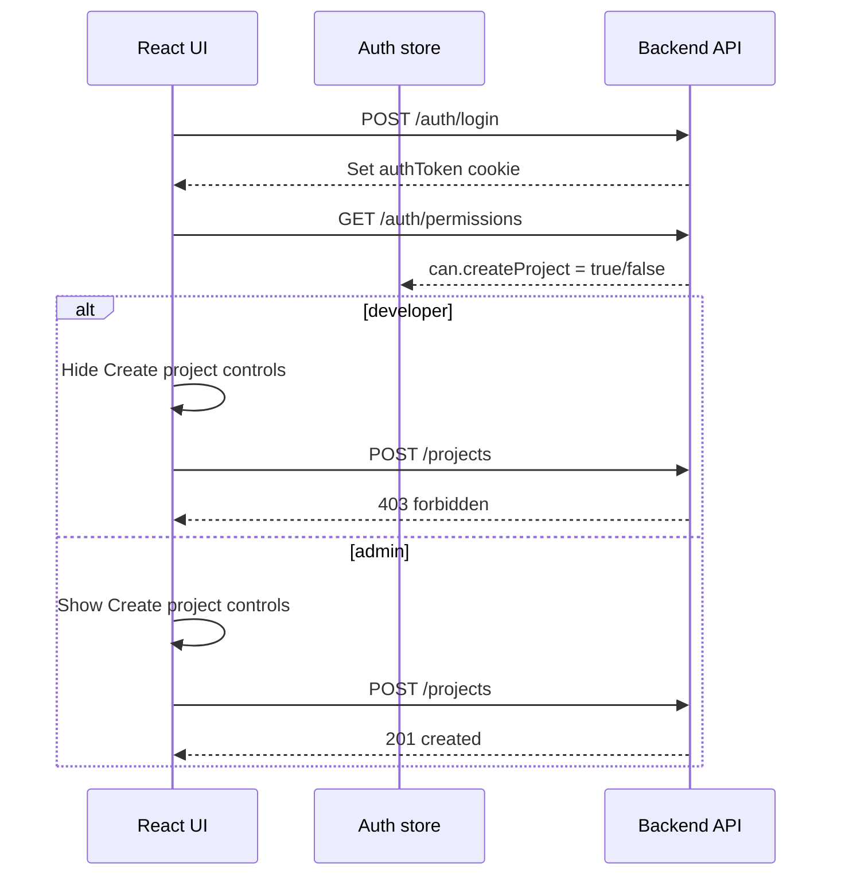

# RBAC — TaskFlow

## Purpose

TaskFlow uses **role-based access control (RBAC)** on top of tenant-scoped roles (`admin` | `developer`) in the database and JWT. Permissions are defined in one backend map, enforced on API routes via middleware, and mirrored on the frontend for UI gating.

**Two layers, both required:**

1. **Permission layer (RBAC)** — “Is this role allowed to perform this action at all?”
2. **Resource layer** — “Can this user access *this* project or task?” (tenant + `project_members`; stays in repositories/services)

The backend is authoritative — hiding a button is UX; the API must enforce the same permission.

See also: [README Architecture](../README.md#-architecture) (database access rules) and [API documentation](../README.md#-api-documentation).

---

## Roles

Defined in `backend/src/shared/constants/users.ts`:

```ts
export enum UserRole {
  Admin = "admin",
  Developer = "developer",
}
```

| Role | Project visibility | Project mutations | User management |
| ---- | ------------------ | ----------------- | --------------- |
| **admin** | All projects in tenant | Create, update, delete any tenant project | List users, change roles, toggle `is_active`, manage members |
| **developer** | Only member projects | Update/delete if a member (delete project: admin only) | None |

---

## Permission strings

Format: **`action:resource`** (lowercase, colon-separated).

| Permission | Admin | Developer | Gates |
| ---------- | ----- | --------- | ----- |
| `create:project` | ✓ | ✗ | Create project UI + `POST /projects` |
| `delete:project` | ✓ | ✗ | Delete project UI + `DELETE /projects/:id` |
| `update:project` | ✓ | ✓* | *Still requires membership in service |
| `view:project` | ✓ | ✓* | *Developer limited to member projects in repository |
| `manage:project_members` | ✓ | ✗ | `POST/DELETE /projects/:id/members` |
| `manage:users` | ✓ | ✗ | `GET/PATCH /users` |
| `create:task` | ✓ | ✓* | *Requires project access |
| `update:task` | ✓ | ✓* | *Requires project access |
| `view:task` | ✓ | ✓* | *Requires project access |
| `delete:task` | ✓ | ✓* | *Admin or member who created task (service rule) |

Frontend flags use camelCase (`createProject`, `manageUsers`, etc.) derived from the same map.

---

## Backend

### Single source of truth — `backend/src/shared/permissions/permissions.ts`

```ts
export const PERMISSIONS = {
  [UserRole.Admin]: [
    "create:project",
    "delete:project",
    // …
  ],
  [UserRole.Developer]: [
    "update:project",
    "view:project",
    // …
  ],
} as const;

export function can(role: UserRole | undefined, action: Permission): boolean;
export function permissionFlags(role: UserRole | undefined): PermissionFlags;
```

Rules:

- **No** inline `role === 'admin'` checks in routes or controllers — use `authorize(...)`.
- Tenant and membership scoping stays in `projects.repository`, `projects.service`, and `tasks.service`.

### Middleware — `backend/src/shared/middlewares/authorize.ts`

```ts
router.post(
  "/",
  authenticate,
  authorize("create:project"),
  validateRequest(createProjectBodySchema),
  handler,
);
```

Returns **401** if unauthenticated, **403** if the role lacks the permission.

### Route permission map

| Method | Path | Permission |
| ------ | ---- | ---------- |
| `POST` | `/projects` | `create:project` |
| `DELETE` | `/projects/:id` | `delete:project` |
| `POST` | `/projects/:id/members` | `manage:project_members` |
| `DELETE` | `/projects/:id/members/:userId` | `manage:project_members` |
| `GET` | `/users` | `manage:users` |
| `PATCH` | `/users/:id` | `manage:users` |

Task routes rely on service-layer membership checks; optional route-level `authorize(...)` can be added for defence in depth.

### Permissions API — `GET /auth/permissions`

Authenticated endpoint returns `permissionFlags(req.user.role)` — used by the frontend on login/bootstrap. Documented in Swagger at `/api-docs`.

### Tests

- `backend/tests/unit/permissions.test.ts` — map and `can()` / `permissionFlags()`
- `backend/tests/unit/middleware.test.ts` — `authorize()` with mocked `req.user`

---

## Frontend

Permissions are loaded from `GET /auth/permissions` after login/bootstrap and stored in the Zustand auth store (`frontend/src/modules/auth/context/auth.store.ts`).

### Types — `frontend/src/modules/auth/types/auth.types.ts`

```ts
export type PermissionCanFlags = {
  createProject: boolean;
  deleteProject: boolean;
  manageProjectMembers: boolean;
  manageUsers: boolean;
  // …
};
```

### Hooks and component

| File | Purpose |
| ---- | ------- |
| `frontend/src/shared/permissions/usePermission.ts` | `useCan('createProject')`, `usePermission('create:project')` |
| `frontend/src/shared/permissions/Can.tsx` | `<Can permission="createProject">…</Can>` |

### Where permissions gate UI

| File | Gated actions |
| ---- | ------------- |
| `frontend/src/shared/layouts/Sidebar.tsx` | Create project, Users nav |
| `frontend/src/shared/layouts/AppShell.tsx` | Create project modal entry |
| `frontend/src/modules/projects/screens/ProjectsListScreen.tsx` | Create project, delete project |
| `frontend/src/modules/projects/screens/ProjectDetailScreen.tsx` | Members panel, delete project |

### Tests

- `frontend/tests/unit/permissions.test.tsx` — `useCan`, `<Can>`
- `frontend/tests/unit/authStore.test.ts` — persisted permission flags

---

## End-to-end flow



---

## How to add a new permission

Example: “Archive project”, admin only.

1. Add `"archive:project"` to `PERMISSIONS[UserRole.Admin]` in `backend/src/shared/permissions/permissions.ts`.
2. Add `archiveProject: can(role, "archive:project")` to `permissionFlags.can`.
3. Add `authorize("archive:project")` on the route.
4. Add `archiveProject` to `PermissionCanFlags` in `frontend/src/modules/auth/types/auth.types.ts`.
5. Wrap UI: `<Can permission="archiveProject">…</Can>`.
6. Add unit tests for the new permission in backend and frontend test files.
7. Update OpenAPI and the Postman collection in `docs/`.

No middleware factory changes required.

---

## File reference

```
backend/src/
  shared/
    constants/users.ts              UserRole enum
    permissions/
      permissions.ts                PERMISSIONS map, can(), permissionFlags()
      index.ts
    middlewares/
      authenticate.ts               JWT → req.user (includes role)
      authorize.ts                  permission gate
  modules/
    auth/routes/auth.routes.ts      GET /permissions
    projects/routes/...             authorize on create/delete/members
    users/routes/...                authorize on manage:users

frontend/src/
  modules/auth/
    types/auth.types.ts             User, PermissionCanFlags
    context/auth.store.ts           persisted user + permissions
    context/AuthContext.tsx         login/bootstrap loads permissions
    api/auth.api.ts                 getPermissions()
  shared/permissions/
    usePermission.ts
    Can.tsx
  shared/layouts/                   Sidebar, AppShell — gated controls
  modules/projects/screens/         Project list/detail — gated actions
```

---

## Constraints

- Use existing stack only (Express, TypeScript, Zod, React) — no new auth libraries.
- Do **not** change DB schema for RBAC; roles already exist on `users`.
- Do **not** move tenant/membership checks into `permissions.ts`.
- Permission checks at the **route** layer; resource ownership/membership in **services**.
