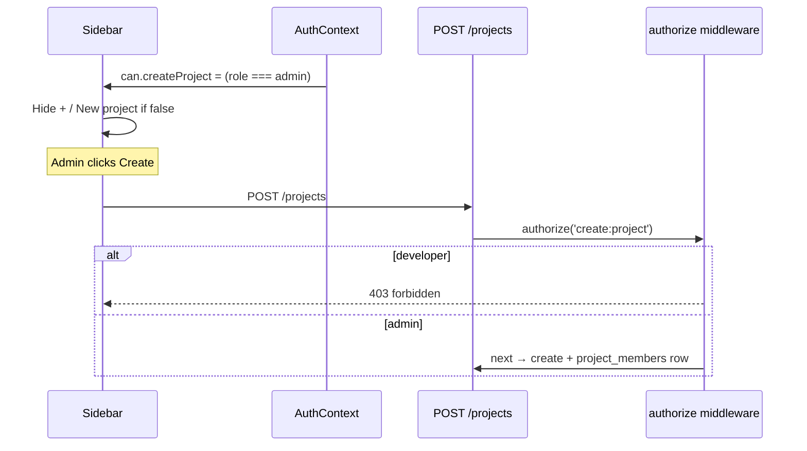

# RBAC Architecture — TaskFlow

## Purpose

TaskFlow already has **tenant-scoped roles** (`admin` | `developer`) in the database and JWT. This document defines a **permission-based RBAC layer** on top of that so UI features (e.g. the **Create project** button) and API routes are gated consistently—and so **new rules can be added in one place** without scattering `role === 'admin'` checks.

**First UI rule to implement:** only **admin** users see the Create project controls (sidebar `+` button and “New project” link in `Sidebar.tsx`, wired through `AppShell.tsx`).

> **Scope of this doc:** architecture and file layout only. Implementation follows this guide in a separate change.

---

## What exists today (baseline)

| Layer | Current behaviour |
| ----- | ----------------- |
| **DB** | `users.role` — `'admin'` \| `'developer'` (`UserRole` enum) |
| **JWT / `req.user`** | `userId`, `email`, `tenantId`, `role` (set by `authenticate.ts`) |
| **Admin gate** | `requireAdmin` middleware on `GET/PATCH /users`, project member routes |
| **Data access** | `projects.repository` — admin sees all tenant projects; developer sees `project_members` only |
| **Service rules** | e.g. delete project = admin only; update = admin or member (inline `UserRole` checks in `projects.service.ts`) |
| **Frontend auth** | `User` type has `id`, `name`, `email` only — **no `role` on client yet** |
| **Create project UI** | Shown to **all** authenticated users (`Sidebar` → `onNewProject` → `AppShell` modal) |
| **Create project API** | `POST /projects` — any authenticated user (no admin gate on route) |

RBAC should **centralise role → permission mapping** and **replace ad-hoc role checks over time**, while **keeping tenant/membership logic** in repositories/services (that is resource scoping, not UI permission).

---

## Design principles

1. **Single source of truth** — one permissions map defines what each role can do.
2. **No inline role checks** in routes, controllers, or React components — use `authorize('action:resource')` (backend) and `usePermission('action:resource')` / `<Can>` (frontend).
3. **Backend is authoritative** — hiding a button is UX; the API must enforce the same permission on `POST /projects`.
4. **Two layers, both needed:**
   - **Permission layer** — “Is this role allowed to perform this action at all?” (RBAC)
   - **Resource layer** — “Can this user access *this* project/task?” (tenant + `project_members`; stays in `projects.service` / `tasks.service`)
5. **Extend by editing one map** — add a permission string, assign it to roles, wire route + UI once.

---

## Roles (TaskFlow)

Defined in `backend/src/shared/constants/users.ts`:

```ts
export enum UserRole {
  Admin = "admin",
  Developer = "developer",
}
```

No additional roles until product requires them. When adding a role, extend the enum and the permissions map only.

---

## Permission strings

Format: **`action:resource`** (lowercase, colon-separated).

| Permission | Admin | Developer | Notes |
| ---------- | ----- | --------- | ----- |
| `create:project` | ✓ | ✗ | Gates Create project UI + `POST /projects` |
| `delete:project` | ✓ | ✗ | Already enforced in service; move to route middleware |
| `update:project` | ✓ | ✓* | *Still requires project membership in service |
| `view:project` | ✓ | ✓* | *Developer limited to member projects in repository |
| `manage:project_members` | ✓ | ✗ | `POST/DELETE /projects/:id/members` |
| `manage:users` | ✓ | ✗ | `GET/PATCH /users` |
| `create:task` | ✓ | ✓* | *Requires project access |
| `update:task` | ✓ | ✓* | *Requires project access |
| `view:task` | ✓ | ✓* | *Requires project access |
| `delete:task` | ✓ | ✓* | *Admin or member who created task (service rule) |

---

## Backend architecture

### 1. `backend/src/shared/permissions/permissions.ts` (NEW)

Central map — **single source of truth**:

```ts
import { UserRole } from "../constants/users";

export const PERMISSIONS: Record<UserRole, readonly string[]> = {
  [UserRole.Admin]: [
    "create:project",
    "delete:project",
    "update:project",
    "view:project",
    "manage:project_members",
    "manage:users",
    "create:task",
    "update:task",
    "view:task",
    "delete:task",
  ],
  [UserRole.Developer]: [
    "update:project",
    "view:project",
    "create:task",
    "update:task",
    "view:task",
    "delete:task",
  ],
} as const;

export type Permission = (typeof PERMISSIONS)[UserRole][number];

export function can(role: UserRole | undefined, action: Permission): boolean {
  if (!role) return false;
  return PERMISSIONS[role]?.includes(action) ?? false;
}

/** Build `{ createProject: true, ... }` for API responses — derived from PERMISSIONS, never hand-maintained per flag */
export function permissionFlags(role: UserRole | undefined) {
  const perms = role ? [...PERMISSIONS[role]] : [];
  const has = (p: Permission) => perms.includes(p);
  return {
    role,
    permissions: perms,
    can: {
      createProject: has("create:project"),
      deleteProject: has("delete:project"),
      updateProject: has("update:project"),
      viewProject: has("view:project"),
      manageProjectMembers: has("manage:project_members"),
      manageUsers: has("manage:users"),
      createTask: has("create:task"),
      updateTask: has("update:task"),
      viewTask: has("view:task"),
      deleteTask: has("delete:task"),
    },
  };
}
```

Rules:
- **No** `if (role === UserRole.Admin)` outside this file and `authorize` middleware.
- To inherit permissions: `[UserRole.Admin]: [...PERMISSIONS[UserRole.Developer], "create:project", ...]`.

Export from `backend/src/shared/permissions/index.ts`.

---

### 2. `backend/src/shared/middlewares/authorize.ts` (NEW)

Generalises today’s `requireAdmin` into a permission factory:

```ts
import type { NextFunction, Request, Response } from "express";
import { can, type Permission } from "../permissions/permissions";

const authorize =
  (action: Permission) =>
  (req: Request, res: Response, next: NextFunction): void => {
    if (!req.user) {
      res.status(401).json({ error: "unauthorized" });
      return;
    }
    if (!can(req.user.role, action)) {
      res.status(403).json({
        error: "forbidden",
        message: `Requires permission: ${action}`,
      });
      return;
    }
    next();
  };

export default authorize;
```

Usage (same pattern as existing `authenticate`):

```ts
router.post(
  "/",
  authenticate,
  authorize("create:project"),
  validateRequest(createProjectBodySchema),
  handler,
);
```

**Migration path:** replace `requireAdmin` on routes with the specific permission:

| Route | Replace `requireAdmin` with |
| ----- | --------------------------- |
| `GET /users` | `authorize("manage:users")` |
| `PATCH /users/:id` | `authorize("manage:users")` |
| `POST /projects/:id/members` | `authorize("manage:project_members")` |
| `DELETE /projects/:id/members/:userId` | `authorize("manage:project_members")` |

Keep `requireAdmin.ts` until all call sites migrate, then delete it.

`authenticate.ts` is unchanged — it already sets `req.user.role` from JWT.

---

### 3. Route permission map (TaskFlow)

Apply `authorize(...)` **in addition to** `authenticate`. Resource checks (membership) stay in services.

| Method | Path | Permission | Existing middleware |
| ------ | ---- | ------------ | ------------------- |
| `POST` | `/projects` | `create:project` | authenticate only today → **add authorize** |
| `DELETE` | `/projects/:id` | `delete:project` | authenticate only → **add authorize** |
| `GET` | `/projects` | `view:project` | optional (list already scoped by role in repo) |
| `GET` | `/projects/:id` | `view:project` | optional |
| `PATCH` | `/projects/:id` | `update:project` | optional |
| `POST` | `/projects/:id/members` | `manage:project_members` | requireAdmin → authorize |
| `DELETE` | `/projects/:id/members/:userId` | `manage:project_members` | requireAdmin → authorize |
| `GET` | `/users` | `manage:users` | requireAdmin → authorize |
| `PATCH` | `/users/:id` | `manage:users` | requireAdmin → authorize |
| `GET/POST` | `/projects/:id/tasks` | `view:task` / `create:task` | optional at route; access enforced in `tasks.service` |
| `PATCH/DELETE` | `/tasks/:id` | `update:task` / `delete:task` | optional at route; access enforced in service |

**Do not** move tenant/membership checks into `permissions.ts` — e.g. a developer with `view:project` still only sees projects where they appear in `project_members`.

---

### 4. `GET /auth/permissions` (NEW)

Expose permissions to the frontend (preferred over parsing role in the client):

**Route:** `backend/src/modules/auth/routes/auth.routes.ts`

```ts
router.get("/permissions", authenticate, (req, res) => {
  const flags = permissionFlags(req.user!.role);
  res.status(200).json(ResponseFormatter.success(flags, "Permissions fetched"));
});
```

Alternatively, extend `GET /auth/profile` to include the same `can` object — but a dedicated endpoint keeps profile stable and matches a clear “bootstrap permissions once” flow.

Login/register responses already return `user.role`; permissions can also be derived client-side from a **shared constant mirror** (see frontend) if you want zero extra round-trip before first paint.

---

### 5. Tests — `backend/src/shared/permissions/__tests__/permissions.test.ts` (NEW)

Unit-test the map and `can()` — no HTTP required:

```
✓ admin has create:project
✓ developer lacks create:project
✓ unknown/missing role returns false
✓ permissionFlags.createProject matches can(role, 'create:project')
```

Optional middleware test with mocked `req.user` (same cases as original guide).

---

### Backend file layout (after implementation)

```
backend/src/
  shared/
    constants/
      users.ts                 ← existing UserRole enum
    permissions/
      permissions.ts             ← NEW — single source of truth
      index.ts
    middlewares/
      authenticate.ts            ← existing (unchanged)
      authorize.ts               ← NEW
      requireAdmin.ts            ← deprecated → remove after migration
  modules/
    auth/routes/auth.routes.ts   ← add GET /permissions
    projects/routes/...          ← add authorize on POST /projects, etc.
    users/routes/...             ← swap requireAdmin → authorize
```

---

## Frontend architecture

Goal: gate **Create project** UI with the same permission string the backend uses, in a way that scales to new buttons/menus.

### 1. Extend auth state with `role` and permissions

**Types** — `frontend/src/types/auth.ts`:

```ts
export type UserRole = "admin" | "developer";

export type User = {
  id: string;
  name: string;
  email: string;
  tenantId: string;
  role: UserRole;
  isActive: boolean;
};

export type PermissionFlags = {
  role: UserRole;
  permissions: string[];
  can: {
    createProject: boolean;
    deleteProject: boolean;
    // … mirror backend permissionFlags.can
  };
};
```

Populate `role` from login/register/profile responses (backend already sends it; frontend store must persist it).

Option A — fetch `GET /auth/permissions` after login/bootstrap and store `PermissionFlags` in auth context / Zustand.  
Option B — duplicate the **same** `PERMISSIONS` map in `frontend/src/shared/permissions/permissions.ts` and compute locally from `user.role` (must stay in sync with backend; comment both files).

**Recommended:** Option A for one source of truth; Option B acceptable for MVP if maps are identical and documented.

---

### 2. `frontend/src/shared/permissions/usePermission.ts` (NEW)

```ts
import { useAuthPermissions } from "../../modules/auth/context/useAuthPermissions";

export function usePermission(action: string): boolean {
  const { permissions } = useAuthPermissions();
  return permissions.includes(action);
}

export function useCan(action: keyof PermissionFlags["can"]): boolean {
  const { can } = useAuthPermissions();
  return Boolean(can[action]);
}
```

---

### 3. `frontend/src/shared/permissions/Can.tsx` (NEW)

Declarative wrapper for any future UI gate:

```tsx
export function Can({
  permission,
  children,
  fallback = null,
}: {
  permission: keyof PermissionFlags["can"];
  children: React.ReactNode;
  fallback?: React.ReactNode;
}) {
  const allowed = useCan(permission);
  return allowed ? <>{children}</> : <>{fallback}</>;
}
```

---

### 4. Apply to Create project (first rule)

**Files to touch when implementing:**

| File | Change |
| ---- | ------ |
| `frontend/src/shared/layouts/Sidebar.tsx` | Wrap `+` button and “New project” in `<Can permission="createProject">` |
| `frontend/src/shared/layouts/AppShell.tsx` | Only register `openNewProject` / modal if user can create (or no-op + hide triggers) |
| `frontend/src/pages/projects/ProjectsListPage.tsx` | If a Create CTA exists on dashboard, gate it the same way |

Example:

```tsx
<Can permission="createProject">
  <button type="button" onClick={onNewProject} aria-label="New project">
    <Plus size={13} />
  </button>
</Can>
```

Developers never see the control; admins do. API returns **403** if a developer calls `POST /projects` anyway.

---

### Frontend file layout (after implementation)

```
frontend/src/
  types/auth.ts                          ← add role, PermissionFlags
  api/auth.api.ts                        ← getPermissions()
  modules/auth/context/                  ← store permissions on bootstrap
  shared/permissions/
    permissions.ts                       ← optional mirror of backend map
    usePermission.ts
    Can.tsx
  shared/layouts/
    Sidebar.tsx                          ← gate Create project
    AppShell.tsx                         ← gate modal entry
```

---

## End-to-end flow (Create project)



---

## How to add a new permission later

Example: “Archive project” button, admin only.

1. Add `"archive:project"` to `PERMISSIONS[UserRole.Admin]` in `backend/src/shared/permissions/permissions.ts`.
2. Add `archiveProject: has("archive:project")` to `permissionFlags.can`.
3. Add `authorize("archive:project")` on the new or existing route (e.g. `PATCH /projects/:id` with `status: archived` if split).
4. Add `archiveProject` to frontend `PermissionFlags.can`.
5. Wrap UI: `<Can permission="archiveProject">…</Can>`.

No middleware factory changes, no new role checks in components.

---

## Constraints (TaskFlow)

- Use existing stack only (Express, TypeScript, Zod, React) — no new auth libraries.
- Do **not** change DB schema for RBAC; roles already exist on `users`.
- Do **not** duplicate business rules: membership/tenant scoping remains in `projects.repository` / `projects.service` / `tasks.service`.
- Permission checks at the **route** layer; resource ownership/membership checks in **services**.

---

## Implementation checklist

### Backend
- [ ] Add `shared/permissions/permissions.ts` + tests
- [ ] Add `authorize` middleware
- [ ] `POST /projects` → `authorize("create:project")`
- [ ] `DELETE /projects/:id` → `authorize("delete:project")`
- [ ] Migrate `requireAdmin` routes to specific `authorize(...)` calls
- [ ] Add `GET /auth/permissions`
- [ ] Update OpenAPI + Postman

### Frontend
- [ ] Extend `User` / auth store with `role`
- [ ] Load permissions on login/bootstrap
- [ ] Add `useCan` / `<Can>`
- [ ] Hide Create project controls unless `can.createProject`
- [ ] (Optional) Gate admin-only nav items when added (user management, member picker)

### Verify
- [ ] Admin sees Create project; developer does not
- [ ] Developer `POST /projects` → 403
- [ ] Admin create still works; developer project list unchanged (membership-based)
